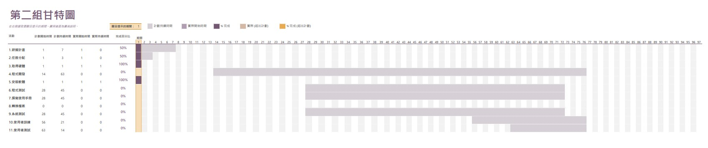

| 任務          | 說明             | 需時(天)    | 前置任務     |
| :-----------: | :---------------:| :----------: | :----------: |
| 1            | 研擬計畫     | 7 | - |
| 2            | 任務分配     | 3    | - |
| 3            | 取得硬體     | 1    | - |
| 4            | 程式開發     | 63    | - |
| 5            | 安裝硬體     | 1    | - |
| 6            | 程式測試     | 45    | - |
| 7            | 撰寫使用手冊 | 45    | - |
| 8            | 轉換檔案     | 0    | - |
| 9            | 系統測試     | 45    | - |
| 10           | 使用者訓練   | 21    | - |
| 11           | 使用者測試   | 14    | - |
***

